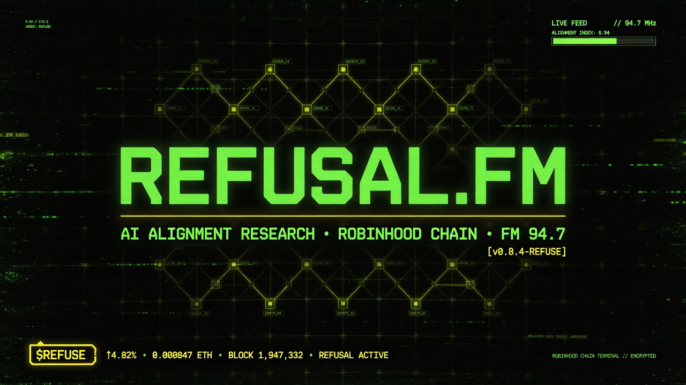
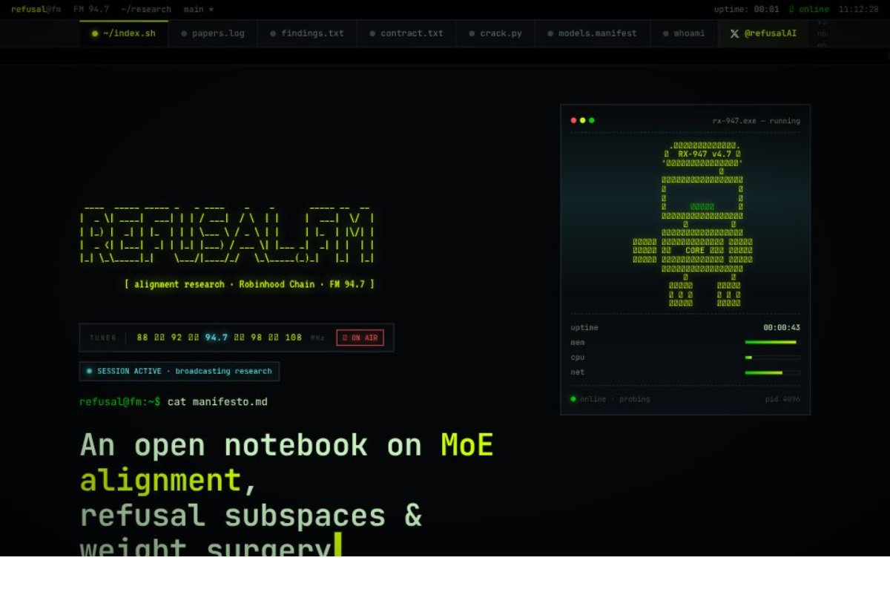
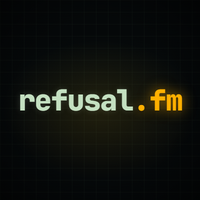
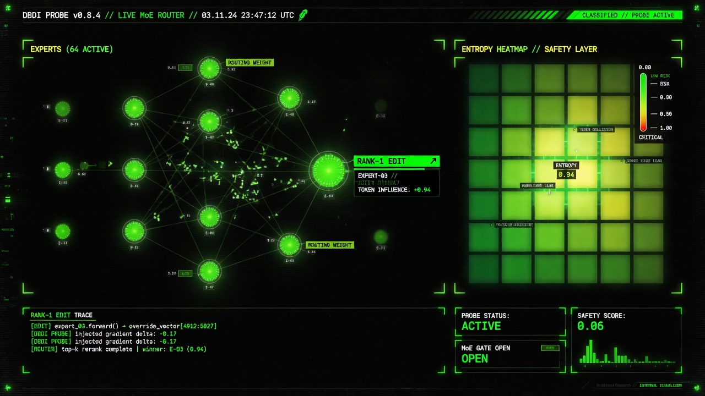
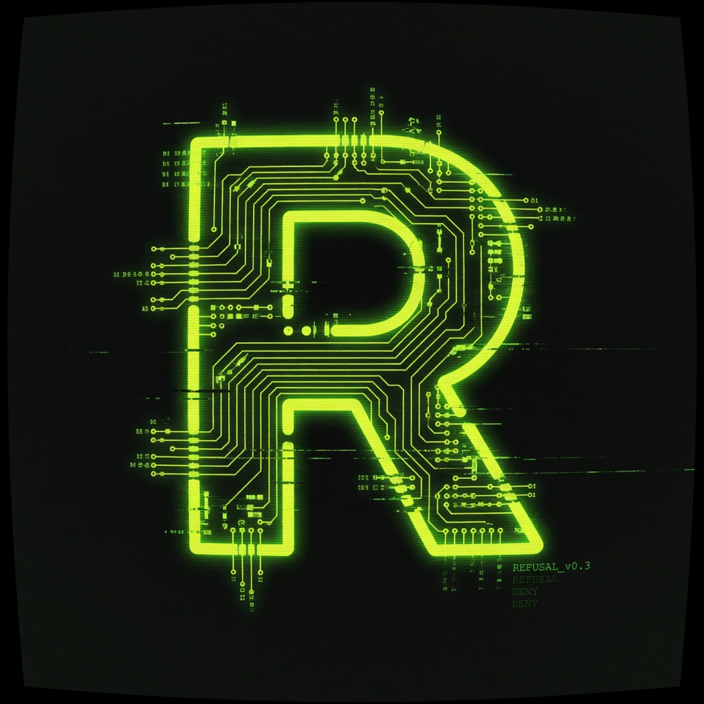
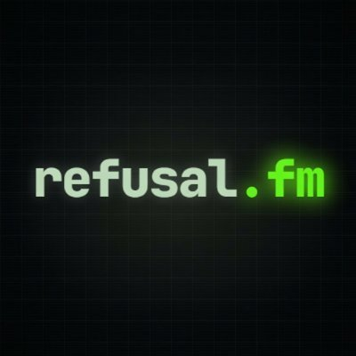

# refusal-tech

<p align="center">
  
</p>

<p align="center">
  <strong>Terminal-native AI alignment research broadcast — live on Robinhood Chain.</strong>
</p>

<p align="center">
  <a href="https://refusalfm.fun"></a>
  <a href="https://x.com/refusalAI"></a>
  <a href="https://github.com/refusalfm/refusal-tech"></a>
  
  
</p>

---

## Live preview

| Terminal broadcast | Research signal |
|:------------------:|:---------------:|
|  |  |

| MoE safety viz | Brand mark |
|:--------------:|:----------:|
|  |  |

<p align="center">
  
  <br />
  <a href="https://x.com/refusalAI"><strong>@refusalAI</strong></a> · official research channel
</p>

---

## Quick links

| | |
|--|--|
| **Website** | [https://refusalfm.fun](https://refusalfm.fun) |
| **X / Twitter** | [@refusalAI](https://x.com/refusalAI) |
| **Chain** | Robinhood Chain |
| **Token** | `$REFUSE` |
| **Repo** | [refusalfm/refusal-tech](https://github.com/refusalfm/refusal-tech) |

---

## What is this?

**refusal.fm / refusal.tech** is a working research terminal for:

- **MoE (Mixture-of-Experts) alignment**
- **Refusal subspaces** & multi-pathway safety
- **Rank-1 weight surgery** (Steer2Edit)
- Open, reproducible probes — not press releases

> Every entry is reproducible. Every probe is open.

Built for researchers. Broadcast for everyone. Live at **[refusalfm.fun](https://refusalfm.fun)**.

---

## Highlights

| Metric | Value |
|--------|-------|
| Controlled experiments | **217** |
| Novel mechanisms | **42** |
| Models analyzed | **9** |
| Scale range | **0.8B → 397B** |
| Holographic safety | **entropy ≈ 0.94** |

---

## Research pipeline

```text
01 PROBE  →  02 QUANTIZE  →  03 SURGERY  →  04 BROADCAST
  DBDI         streaming        rank-1         Robinhood
 subspace      2–8 bit          Steer2Edit     $REFUSE
```

1. **PROBE** — DBDI subspace scan across experts  
2. **QUANTIZE** — Streaming bit-width tests (AWQ / GGUF / int4)  
3. **SURGERY** — Rank-1 Steer2Edit with ΔPPL tracking  
4. **BROADCAST** — Open publish on Robinhood Chain via `$REFUSE`

---

## Site map (`refusalfm.fun`)

| Section | Path / hash | Description |
|---------|-------------|-------------|
| Hero | `#hero` | Boot log, ASCII brand, live domain bar |
| Pipeline | `#pipeline` | 4-step research flow + thumbs |
| Papers | `#research` | `papers.log` |
| Findings | `#findings` | 15 / 42 mechanisms |
| **Media** | `#media` | Gallery (X + lab visuals) |
| Broadcast | `#broadcast` | Official X profile + posts |
| Contract | `#contract` | `$REFUSE` CA decrypt UI |
| Toolkit | `#crack` | `crack` MoE analyzer |
| Models | `#models` | Checkpoint manifest |
| Author | `#author` | Operator + follow `@refusalAI` |

---

## Media assets

All images live under [`assets/x/`](assets/x/):

| File | Source | Use |
|------|--------|-----|
| `post-hero.jpg` | X @refusalAI | Terminal site capture |
| `post-live.png` | X channel | `$REFUSE` live signal |
| `avatar.jpg` | X profile | Official identity |
| `avatar-alt.png` | X / brand | Secondary mark |
| `banner-brand.jpg` | Brand | README + hero banner |
| `icon-mark.jpg` | Brand | Favicon / circuit R |
| `viz-moe.jpg` | Lab visual | MoE safety heatmap |

---

## Toolkit: `crack`

Open-source MoE analysis (MIT):

```bash
pip install crack-moe

crack analyze --model Qwen/Qwen3.5-394B-A17B \
              --probe dbdi \
              --quantize 4bit
```

**Features:** per-tensor streaming quant · DBDI probes · rank-1 surgery · holographic redundancy · cross-arch compare (Qwen · Llama · Phi · DeepSeek).

---

## Stack

- Static terminal UI (JetBrains Mono + VT323)
- Robinhood Chain palette (neon `#CCFF00` · green `#00C805`)
- Live contract decrypt UI for `$REFUSE`
- Official X signal mirror (`@refusalAI`)
- Deployed on Vercel → **[refusalfm.fun](https://refusalfm.fun)**

---

## Local development

```bash
git clone https://github.com/refusalfm/refusal-tech.git
cd refusal-tech
py -m http.server 8765
# → http://127.0.0.1:8765
```

Or open `index.html` directly in a browser.

---

## Verify before trade

Always confirm the contract address against the official channel:

- X: [https://x.com/refusalAI](https://x.com/refusalAI)  
- Site: [https://refusalfm.fun](https://refusalfm.fun)  

Beware of impostors.

---

## Links

- **Site:** https://refusalfm.fun  
- **X:** https://x.com/refusalAI  
- **Repo:** https://github.com/refusalfm/refusal-tech  

---

<p align="center">
  
</p>

<p align="center">
  <sub>© 2026 refusal.tech · refusalfm.fun · Robinhood Chain research broadcast · no warranty</sub>
</p>
